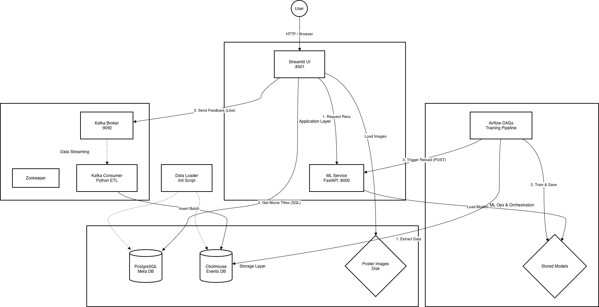

# 🎬 MovieRecs: Movie Recommender System

**Potential Business Customer:** Streaming Platforms

---

## Problem Statement & Business Value
**The Problem:** Users may **struggle selecting content** on streaming platforms due to the overwhelming number of choices, thus spending excessive time on content discovery. New users may abandon the platform without watching a single movie due to the lack of handling the  **Cold Start** problem. These issues may lead to increased Churn Rate and lost revenue.

**The Solution:** A hybrid recommendation system.
*   **Personalization:** Utilizes *iALS* for active users to uncover their preferences.
*   **Cold Start Handling:** Implements a fallback mechanism to *popularity-based* model for new users.
*   **Feedback Loop:** Instantly processes user interactions (likes) for continuous model improvement.

**Anticipated Business Impact:**
*   **Reduction** in content discovery time.
*   **Increased CTR** (Click-Through Rate) in recommendation feed.
*   **Higher Retention** achieved through relevant content delivery.

---

## Architecture & Tech Stack

| Component | Technologies | Description |
| :--- | :--- | :--- |
| **ML Core** | `Rectools`, `Implicit` | iALS + Popularity Model. |
| **Inference** | `FastAPI` | ML Service API. Supports **recommendation generation** and **model reload**. |
| **Streaming** | `Kafka`, `Zookeeper` | Collecting real-time feedback. |
| **Storage** | `ClickHouse`, `PostgreSQL` | **CH:** Storing interactions for training. **PG:** Metadata (Titles, Genres). |
| **Orchestration** | `Apache Airflow` | Scheduled daily retraining. |
| **Observability**| `Grafana`, `Prometheus`, `Loki`, `Promtail` | Monitoring + Visualizations. |
| **UI** | `Streamlit` | Interactive interface for demonstration and feedback collection. |
| **Containerization** | `Docker`, `Docker Compose` | Project assembling and deployment. |

---

## Data & ML Pipeline

**Data Sources (MovieLens + Live Events):**
1.  **Interactions:** `User ID` :: `Movie ID` :: `Rating` :: `Timestamp`.
2.  **Items Meta:** Release Year, Titles, Genres.
3.  **Users Meta:** Demographics (Age, Gender, Occupation).

**The ML-Loop:**
1.  **Ingestion:** User likes a movie $\rightarrow$ Kafka $\rightarrow$ ClickHouse (Real-time).
2.  **Training (Offline):** Airflow extracts data $\rightarrow$ Retrains recommendation models $\rightarrow$ Saves new models.
3.  **Deploy:** Airflow triggers ML Service $\rightarrow$ Service reloads new models for inference.

---

## Architecture Diagram

**NB!** Observability components are omitted for readability.
